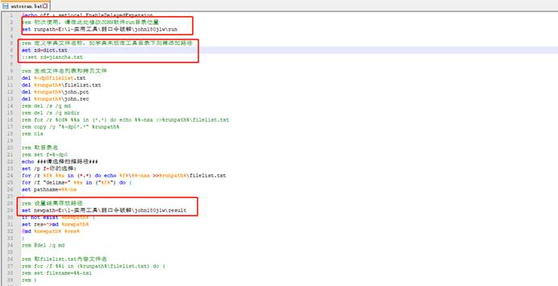

## john

脚本为：autoscan.bat

标红处为脚本文件需要修改处

## 空口令检测

直接运行python Empty-password-v2.py 自动遍历目录下所有文件(包含子文件夹中文件)

## 弱口令结果提取
普通搜索 全选删除

(sha512crypt, crypt(3) $6$ [SHA512 256/256 AVX2 4x])

正则搜索
\s\(.*\)$